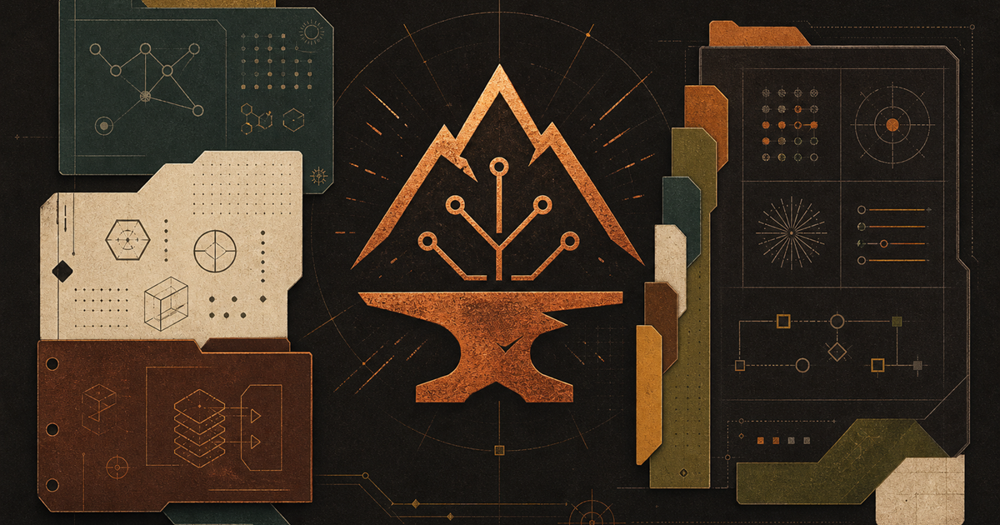

# OKHP3/skillz



**Agent Skills by OverKill Hill P³™.** Gotta have the skillz to pay the bills.

Portable, composable [Agent Skills](https://agentskills.io) in the `SKILL.md` format. Each skill is a self-contained delegation contract that defines the task, available tools, expected behavior, safety boundaries, and quality gates.

[Launch Skillz Forge](https://okhp3.github.io/skillz/) · [Read the OverKill Hill project dossier](https://overkillhill.com/projects/skillz/) · [View the source](https://github.com/OKHP3/skillz)

## What this repository is

`skillz` is the executable agent-skill substrate for the OKHP3 Visual Language Stack. It packages recurring methods as portable, agent-readable contracts that can run across compatible agent runtimes without repeating the same human explanation.

The conceptual evolution is:

```text
mega-prompt
→ reusable prompt kit
→ repo-scoped instruction file
→ SKILL.md
→ portable agent execution contract
→ composable skill family
```

A mega-prompt is authored once, used once, and forgotten. A `SKILL.md` is authored once and reused indefinitely.

The repository is the source of truth for installable skill files. [Skillz Forge](https://okhp3.github.io/skillz/) is the public discovery and sharing surface. [OverKill Hill](https://overkillhill.com/projects/skillz/) is the canonical project narrative and brand home.

## Skillz Forge

[Skillz Forge](https://okhp3.github.io/skillz/) is the flagship interactive catalog for this repository. It helps a person start with an outcome, find a relevant delegation contract, understand how it works, and move into GitHub when they are ready to install, discuss, or contribute.

The Forge currently provides:

- Natural-language discovery across the generated catalog.
- Family and maturity filtering.
- Full skill detail views with triggers, examples, companions, and safety guidance.
- Curated stacks that show how skills compose into a larger workflow.
- Favorites stored locally in the browser.
- Copyable install commands, raw file links, GitHub source links, and contribution entry points.
- FAQ, contribution guidance, and an activity surface connected to repository context.

The Forge is a read-friendly view over the repository, not a second catalog. GitHub remains authoritative for source files, history, issues, pull requests, reviews, and installable artifacts. The generated catalog is the bridge between those files and the interactive experience.

Planned expansion includes richer metadata facets for topics, tools, runtimes, outputs, and patterns, followed by authenticated GitHub collaboration such as issue discussion, pull-request context, and review-aware contribution flows. These are intentionally described as product direction until the corresponding GitHub integration is live.

## How the public surfaces fit together

| Surface | Role | Link |
|---|---|---|
| GitHub repository | Canonical source for `SKILL.md` files, references, validation, history, issues, and pull requests. | [OKHP3/skillz](https://github.com/OKHP3/skillz) |
| Skillz Forge SPA | Interactive discovery, comparison, stack composition, sharing, and contribution routing. | [okhp3.github.io/skillz](https://okhp3.github.io/skillz/) |
| OverKill Hill project page | Flagship project dossier with the rationale, system relationship, scope, roadmap, and live-surface links. | [overkillhill.com/projects/skillz](https://overkillhill.com/projects/skillz/) |
| Prompt Forge | Upstream protocol and specification surface for governed AI workflows and Replit-ready builds. | [Prompt Forge](https://overkillhill.com/prompt-forge/) |
| FoundRy | Related OverKill Hill path for turning reusable AI methods into governed child projects. | [OverKill Hill](https://overkillhill.com/) |

The intended journey is:

```text
Need an outcome
→ discover in Skillz Forge
→ inspect the SKILL.md contract
→ install or compose a stack
→ open the GitHub source
→ discuss, improve, or contribute
```

## Stack position

`skillz` sits at the execution layer of the OKHP3 Visual Language Stack. [ReFolDec](refolddec/) names the transformation theory. [Mermaid Theme Builder](https://github.com/OKHP3/mermaid-theme-builder) is the visual-governance layer. [BPMN for Mermaid](https://github.com/OKHP3/mermaid-diagram-bpmn) is the process-notation layer.

See [`docs/STACK-POSITION.md`](docs/STACK-POSITION.md) for the full stack map.

## Start here

Read [`AGENTS.md`](AGENTS.md) first. It is the always-on routing index for this repository: what each skill does, when it triggers, which companions it uses, and where it lives.

If you are evaluating the product rather than authoring a skill, start with [Skillz Forge](https://okhp3.github.io/skillz/), then read the [OverKill Hill Skillz project page](https://overkillhill.com/projects/skillz/).

## Core documents

| File | Purpose |
|---|---|
| `AGENTS.md` | Always-on agent routing index. Read first. |
| `docs/STACK-POSITION.md` | Stack position, conceptual evolution, and layer map. |
| `docs/PUBLIC_SURFACES.md` | Public information architecture for OverKill Hill, Glee-fully, and AskJamie touchpoints. |
| `docs/PUBLISHING.md` | Validation, release, registry, and promotion checklist. |
| `docs/SECURITY.md` | Skill supply-chain and employer-data safety posture. |
| `docs/CHANGELOG.md` | Change log until the first release tag and beyond. |
| `docs/BACKLOG.md` | Maturity model, promotion priorities, and planned families. |
| `skillz.manifest.json` | Lightweight machine-readable manifest for the skill library. |
| `docs/SKILLZ-FORGE-REPLIT-BUILD-DIRECTIVE.md` | Earlier Replit build directive for the interactive catalog. |
| `docs/PRD-OVERKILL-HILL-SKILLZ-FLAGSHIP-PROJECT-REPLIT.md` | Replit PRD for the OverKill Hill flagship project page and route model. |
| `docs/PRD-SKILLZ-FORGE-FLAGSHIP-SPA-REPLIT.md` | Replit PRD for the branded Skillz Forge SPA. |

## Families

<!-- FAMILIES_TABLE_START -->
<!-- Generated: 2026-07-18 03:58 UTC | Families: 11 (9 active) -->

*11 families &nbsp;·&nbsp; 9 active &nbsp;·&nbsp; updated: **July 18, 2026 at 03:58 UTC***

| Family | Skills | What it covers |
|---|---|---|
| [`abrahamic/`](abrahamic/FAMILY.md) | 4 | A family of 4 skills. Find thematically parallel passages across Judaism, Christianity,... |
| [`askjamie/`](askjamie/README.md) | — placeholder | One of the three OKHP3 sub-brands — a conversational resume / helpdesk tool. No skill d... |
| [`community/`](community/FAMILY.md) | 13 | A family of 13 skills. Create AI-powered social media content for TikTok, Instagram, Yo... |
| [`glee-fully/`](glee-fully/README.md) | — placeholder | Conversion target for the Glee-fully custom GPT catalog (~42 GPTs from the `Glee-fullyT... |
| [`lifetrkr/`](lifetrkr/FAMILY.md) | 2 | A family of 2 skills. Calculate moon phase, astrological season, and Mercury retrograde... |
| [`linkedin/`](linkedin/FAMILY.md) | 3 | Three skills, one pipeline: voice -> angles -> post. |
| [`mermaid/`](mermaid/FAMILY.md) | 9 | Nine skills. One foundation, four domain skills, one publish layer, one update skill, o... |
| [`notion/`](notion/FAMILY.md) | 1 | This family covers Notion-centered knowledge operations for OKHP3. |
| [`process-capture/`](process-capture/FAMILY.md) | 16 | One skill: `okhp3-process-capture`. The meta-layer. |
| [`refolddec/`](refolddec/FAMILY.md) | 1 | Agent Skills for ReFolDec operations — recursive folding, unfolding, and refolding acro... |
| [`universal/`](universal/FAMILY.md) | 7 | A family of 6 skills. Create a Cloudflare Worker that proxies API calls from a static f... |
<!-- FAMILIES_TABLE_END -->

## *"Skillz"* Inventory

<!-- SKILLS_CATALOG_START -->
<!-- ⚠️ DO NOT EDIT THIS SECTION MANUALLY — regenerated by scripts/gen-skills-readme.py -->
<!-- Generated: 2026-07-18 03:58 UTC | Skills: 56 | Categories: 9 | Mode: library | Surface: distribution -->

*Catalog last updated: **July 18, 2026 at 03:58 UTC** &nbsp;·&nbsp; **56** skills across **9** categories*

### abrahamic (4 skills)

| Skill | Description | Version |
|---|---|---|
| [okhp3-cross-tradition-compare](abrahamic\okhp3-cross-tradition-compare\SKILL.md) | Find thematically parallel passages across Judaism, Christianity, and Islam. Embeds 20 pre-seeded... | 1.1.0 |
| [okhp3-tradition-observance-calendar](abrahamic\okhp3-tradition-observance-calendar\SKILL.md) | Fetch, compute, and format religious observance calendars for the three in-scope Abrahamic tradit... | 1.1.0 |
| [okhp3-tradition-reference](abrahamic\okhp3-tradition-reference\SKILL.md) | Compact structured reference for each of the three in-scope Abrahamic traditions -- Judaism, Chri... | 1.1.0 |
| [okhp3-verse-lookup](abrahamic\okhp3-verse-lookup\SKILL.md) | Fetch a scripture passage from Judaism, Christianity, or Islam using free anonymous public APIs. ... | 1.1.0 |

### community (13 skills)

| Skill | Description | Version |
|---|---|---|
| [ai-social-media-content](community\ai-social-media-content\SKILL.md) | Create AI-powered social media content for TikTok, Instagram, YouTube, Twitter/X. Generate: image... | — |
| [architecture-decision-records](community\architecture-decision-records\SKILL.md) | Write and maintain Architecture Decision Records (ADRs) following best practices for technical de... | — |
| [brand-guidelines](community\brand-guidelines\SKILL.md) | Applies Anthropic's official brand colors and typography to any sort of artifact that may benefit... | — |
| [find-skills](community\find-skills\SKILL.md) | Helps agents discover, evaluate, and recommend installable agent skills when a task may be better... | — |
| [frontend-design](community\frontend-design\SKILL.md) | Create distinctive, production-grade frontend interfaces with high design quality. Use this skill... | — |
| [mcp-builder](community\mcp-builder\SKILL.md) | Guide for creating high-quality MCP (Model Context Protocol) servers that enable LLMs to interact... | — |
| [mermaid-diagrams](community\mermaid-diagrams\SKILL.md) | Comprehensive guide for creating software diagrams using Mermaid syntax. Use when users need to c... | — |
| [skill-creator](community\skill-creator\SKILL.md) | Create new skills, modify and improve existing skills, and measure skill performance. Use when us... | — |
| [theme-factory](community\theme-factory\SKILL.md) | Toolkit for styling artifacts with a theme. These artifacts can be slides, docs, reportings, HTML... | — |
| [vercel-react-best-practices](community\vercel-react-best-practices\SKILL.md) | React and Next.js performance optimization guidelines from Vercel Engineering. This skill should ... | 1.0.0 |
| [vercel-react-native-skills](community\vercel-react-native-skills\SKILL.md) | React Native and Expo best practices for building performant mobile apps. Use when building React... | 1.0.0 |
| [web-artifacts-builder](community\web-artifacts-builder\SKILL.md) | Suite of tools for creating elaborate, multi-component claude.ai HTML artifacts using modern fron... | — |
| [web-design-guidelines](community\web-design-guidelines\SKILL.md) | Review UI code for Web Interface Guidelines compliance. Use when asked to "review my UI", "check ... | 1.0.0 |

### lifetrkr (2 skills)

| Skill | Description | Version |
|---|---|---|
| [okhp3-celestial-data](lifetrkr\okhp3-celestial-data\SKILL.md) | Calculate moon phase, astrological season, and Mercury retrograde status for any date using pure ... | 1.1.0 |
| [okhp3-daily-oracle](lifetrkr\okhp3-daily-oracle\SKILL.md) | Generates a personalized daily reading by combining a tarot card, a daily horoscope, and an AI-sy... | 1.0 |

### linkedin (3 skills)

| Skill | Description | Version |
|---|---|---|
| [okhp3-linkedin-angles](linkedin\okhp3-linkedin-angles\SKILL.md) | Mine a finished artifact (PRD, SKILL.md, technical writeup, governance doc, Mermaid diagram, or t... | — |
| [okhp3-linkedin-post](linkedin\okhp3-linkedin-post\SKILL.md) | Draft a LinkedIn post from a chosen angle. Use when the user has picked a candidate from okhp3-li... | — |
| [okhp3-linkedin-voice](linkedin\okhp3-linkedin-voice\SKILL.md) | Apply the OKHP3 brand voice to any LinkedIn-bound text. Use as the FINAL pass on any LinkedIn pos... | — |

### mermaid (9 skills)

| Skill | Description | Version |
|---|---|---|
| [okhp3-mermaid-architecture](mermaid\okhp3-mermaid-architecture\SKILL.md) | System and solution architecture diagrams in Mermaid for technical audiences — C4 model (Context/... | — |
| [okhp3-mermaid-bpmn](mermaid\okhp3-mermaid-bpmn\SKILL.md) | BPMN-informed business process modeling in Mermaid. Use whenever the user wants to diagram a busi... | — |
| [okhp3-mermaid-core](mermaid\okhp3-mermaid-core\SKILL.md) | Foundation skill for ALL Mermaid diagram work. Load this first for any task involving Mermaid syn... | — |
| [okhp3-mermaid-data](mermaid\okhp3-mermaid-data\SKILL.md) | Data model and relationship diagrams in Mermaid — entity-relationship (ER) diagrams, class diagra... | — |
| [okhp3-mermaid-governance](mermaid\okhp3-mermaid-governance\SKILL.md) | Governance profile management for Mermaid diagram projects. Use when the user wants to establish ... | — |
| [okhp3-mermaid-publish](mermaid\okhp3-mermaid-publish\SKILL.md) | Rendering, exporting, and publishing finished Mermaid diagrams. Use after a diagram has passed ok... | — |
| [okhp3-mermaid-repair](mermaid\okhp3-mermaid-repair\SKILL.md) | Syntax repair for broken Mermaid diagrams. Use when a .mmd file or fenced Mermaid block fails to ... | — |
| [okhp3-mermaid-theme-builder](mermaid\okhp3-mermaid-theme-builder\SKILL.md) | Apply reusable color palettes and visual governance to Mermaid diagram code. Use this skill when ... | — |
| [okhp3-mermaid-update](mermaid\okhp3-mermaid-update\SKILL.md) | Style-preserving update of an existing Mermaid diagram. Use when the user provides an existing .m... | — |

### notion (1 skill)

| Skill | Description | Version |
|---|---|---|
| [okhp3-notion-capture-router](notion\okhp3-notion-capture-router\SKILL.md) | Use this skill when converting ChatGPT, Claude, Perplexity, Copilot, Gemini, PDF exports, or past... | 0.1.0 |

### process-capture (16 skills)

| Skill | Description | Version |
|---|---|---|
| [okhp3-as-is-process-capture](process-capture\okhp3-as-is-process-capture\SKILL.md) | Capture and normalise a current-state process description into a structured as-is process YAML wi... | 0.1.0 |
| [okhp3-decision-model-authoring](process-capture\okhp3-decision-model-authoring\SKILL.md) | Author and validate decision models from PNS decision points using DMN-aligned rule tables. Use t... | 0.1.0 |
| [okhp3-elicitation-and-interview-facilitation](process-capture\okhp3-elicitation-and-interview-facilitation\SKILL.md) | Plan and facilitate structured elicitation sessions using BABOK v3 interview and workshop techniq... | 0.1.0 |
| [okhp3-future-state-and-change-strategy](process-capture\okhp3-future-state-and-change-strategy\SKILL.md) | Design a target-state process and a structured change strategy from a gap analysis. Use this skil... | 0.1.0 |
| [okhp3-process-capture](process-capture\okhp3-process-capture\SKILL.md) | Capture a recurring task as either a backlog entry or a new skill skeleton. Use when the user say... | — |
| [okhp3-process-gap-and-exception-analysis](process-capture\okhp3-process-gap-and-exception-analysis\SKILL.md) | Identify deviations, gaps, and exception paths between an as-is process capture and its intended ... | 0.1.0 |
| [okhp3-process-intake-and-scope](process-capture\okhp3-process-intake-and-scope\SKILL.md) | Conduct structured process intake and scope definition using BABOK v3 elicitation techniques. Use... | 0.1.0 |
| [okhp3-process-measures-and-controls-definition](process-capture\okhp3-process-measures-and-controls-definition\SKILL.md) | Define process performance measures, KPIs, and compliance controls for a validated PNS. Use this ... | 0.1.0 |
| [okhp3-process-narrative-authoring](process-capture\okhp3-process-narrative-authoring\SKILL.md) | Author and validate a Process Narrative Specification (PNS) from a PIR and stakeholder register. ... | 0.1.0 |
| [okhp3-process-validation-and-quality-scoring](process-capture\okhp3-process-validation-and-quality-scoring\SKILL.md) | Orchestrate the full V1–V9 validation suite across all BP-SKILL process artifacts and produce a 0... | 0.1.0 |
| [okhp3-publication-and-handoff-packaging](process-capture\okhp3-publication-and-handoff-packaging\SKILL.md) | Assemble all validated BP-SKILL process artifacts into a publication-ready bundle with a manifest... | 0.1.0 |
| [okhp3-raci-and-governance-matrix-generation](process-capture\okhp3-raci-and-governance-matrix-generation\SKILL.md) | Generate and validate a RACI matrix and governance responsibility document from a validated PNS. ... | 0.1.0 |
| [okhp3-sipoc-generation](process-capture\okhp3-sipoc-generation\SKILL.md) | Generate a SIPOC table from a validated PNS. Use this skill when the user needs a high-level proc... | 0.1.0 |
| [okhp3-sop-and-work-instruction-generation](process-capture\okhp3-sop-and-work-instruction-generation\SKILL.md) | Generate Standard Operating Procedures (SOPs) and work instructions from a validated PNS. Use thi... | 0.1.0 |
| [okhp3-stakeholder-and-role-mapping](process-capture\okhp3-stakeholder-and-role-mapping\SKILL.md) | Derive and validate a structured stakeholder register from a completed Process Intake Record. Use... | 0.1.0 |
| [okhp3-visual-process-modeling](process-capture\okhp3-visual-process-modeling\SKILL.md) | Generate, validate, normalise, and explain Mermaid-native bpmn-beta diagrams from a Process Narra... | 0.1.0 |

### refolddec (1 skill)

| Skill | Description | Version |
|---|---|---|
| [okhp3-refolddec-core](refolddec\okhp3-refolddec-core\SKILL.md) | Core ReFolDec transformation skill. Use when the task is explicitly about transforming an artifac... | — |

### universal (7 skills)

| Skill | Description | Version |
|---|---|---|
| [okhp3-cloudflare-worker-api-proxy](universal\okhp3-cloudflare-worker-api-proxy\SKILL.md) | Create a Cloudflare Worker that proxies API calls from a static frontend to a keyed API, keeping ... | 1.0.0 |
| [okhp3-custom-gpt-builder](universal\okhp3-custom-gpt-builder\SKILL.md) | >- | 1.1.0 |
| [okhp3-foundry-repo-creator](universal\okhp3-foundry-repo-creator\SKILL.md) | Create governed FoundRy child repositories from Custom GPTs, Gemini Gems, Copilot agents, prompt ... | — |
| [okhp3-google-gis-client-auth](universal\okhp3-google-gis-client-auth\SKILL.md) | Implement client-only Google OAuth for React SPAs using the Google Identity Services (GIS) implic... | 1.0.0 |
| [okhp3-skill-cataloger](universal\okhp3-skill-cataloger\SKILL.md) | OverKill Hill P³ skill cataloger. Discover, index, and catalog all Agent Skills in a repository's... | 1.4.0 |
| [okhp3-skill-foundry](universal\okhp3-skill-foundry\SKILL.md) | OverKill Hill P³ Skill Foundry -- complete eight-phase methodology for creating, honing, and poli... | 1.0.0 |
| [okhp3-vite-github-pages](universal\okhp3-vite-github-pages\SKILL.md) | Deploy a React or Vue SPA built with Vite to GitHub Pages using the gh-pages npm package. Covers ... | 1.0.0 |

<!-- SKILLS_CATALOG_END -->


## Install a skill

Any agent runtime that supports the Agent Skills standard can use these contracts. For Claude Code, OpenCode, or GitHub Copilot:

```bash
git clone https://github.com/OKHP3/skillz.git
cp -r skillz/mermaid/okhp3-mermaid-core .claude/skills/
```

Once the repository is tagged and released, the GitHub CLI installation shape is:

```bash
gh skill install OKHP3/skillz okhp3-mermaid-core
```

For OpenClaw, mount this repository and point the system prompt at [`AGENTS.md`](AGENTS.md). For another skill, replace the example path with the family and skill directory shown in [Skillz Forge](https://okhp3.github.io/skillz/).

## Structure

Every distribution skill follows the standard anatomy:

```text
skill-name/
├── SKILL.md          required frontmatter and instructions
└── references/       supporting material loaded on demand
```

The `SKILL.md` is the delegation contract. References should hold deeper material that an agent only needs when the task requires it. Family-level `FAMILY.md` files explain how related skills compose.

## Asset and install-surface kit

The branded image kit lives under [`forge/public/assets/`](forge/public/assets/). The source artwork is intentionally kept separate from the deployment-sized derivatives.

| Asset | Intended use |
|---|---|
| [`skillz-forge-social-preview.png`](forge/public/assets/skillz-forge-social-preview.png) | GitHub repository social preview and Open Graph image, 1200×630. |
| [`skillz-forge-social-art.png`](forge/public/assets/skillz-forge-social-art.png) | Wide source artwork for future crops or branded page compositions, 1536×1024. |
| [`skillz-forge-icon-512.png`](forge/public/assets/skillz-forge-icon-512.png) | PWA install icon, 512×512. |
| [`skillz-forge-icon-192.png`](forge/public/assets/skillz-forge-icon-192.png) | PWA install icon, 192×192. |
| [`apple-touch-icon.png`](forge/public/assets/apple-touch-icon.png) | iPhone and iPad home-screen icon, 180×180. |
| [`favicon-32.png`](forge/public/assets/favicon-32.png) | Browser tab favicon, 32×32. |

The intended SPA metadata references are:

```html
<link rel="manifest" href="/skillz/manifest.webmanifest">
<link rel="apple-touch-icon" sizes="180x180" href="/skillz/assets/apple-touch-icon.png">
<meta name="theme-color" content="#2a2320">
```

When the SPA is served under another base path, derive these URLs from the deployed base path instead of hard-coding `/skillz/`.

## Public surface model

The canonical project narrative lives under OverKill Hill:

```text
https://overkillhill.com/projects/skillz/
```

The interactive catalog lives at:

```text
https://okhp3.github.io/skillz/
```

Skillz Forge is the discovery and collaboration bridge. It should route visitors to GitHub for authoritative source, installation, history, issues, pull requests, reviews, and contribution. Glee-fully and AskJamie should use lightweight contextual touchpoints that route back to the OverKill Hill project page. See [`docs/PUBLIC_SURFACES.md`](docs/PUBLIC_SURFACES.md).

## Contributing

Start with [`AGENTS.md`](AGENTS.md), then read [`docs/PUBLISHING.md`](docs/PUBLISHING.md) and [`docs/SECURITY.md`](docs/SECURITY.md). Keep public examples synthetic or public-safe. Do not add credentials, cookies, employer-confidential material, hidden network calls, destructive behavior, or instructions that bypass consent or permissions.

For a new skill, use the [Skill Foundry guidance](.agents/skills/okhp3-skill-foundry/SKILL.md) and validate the result with the repository's authoring tools. For catalog changes, use the cataloger workflow and do not hand-edit the generated inventory sections in this README.

## License

MIT. See [`LICENSE`](LICENSE). The repository is informed by the community Agent Skills ecosystem; it does not copy code or text from external skills.

## Status note

This repository is unreleased and has no Git tags. Skills marked "Built (skeleton)" have complete frontmatter and section structure, but their reference coverage varies. Treat a skeleton as the delegation contract's shape, not as a claim that every supporting section is finished.
