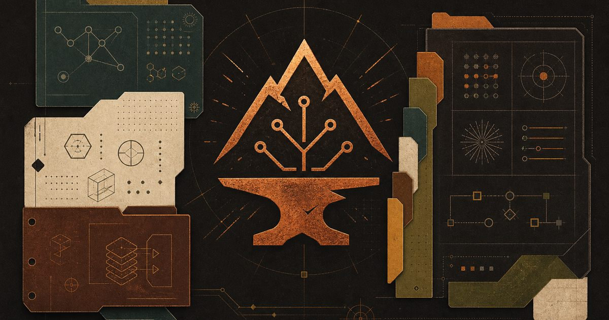

# OKHP3/skillz



**Agent Skills by OverKill Hill P³™.** Gotta have the skillz to pay the bills.

Portable, composable [Agent Skills](https://agentskills.io) in the `SKILL.md` format. Each skill is a self-contained delegation contract that defines the task, available tools, expected behavior, safety boundaries, and quality gates.

[Launch Skillz Forge](https://okhp3.github.io/skillz/) · [Read the OverKill Hill project dossier](https://overkillhill.com/projects/skillz/) · [View the source](https://github.com/OKHP3/skillz)

## What this repository is

`skillz` is the executable agent-skill substrate for the OKHP3 Visual Language Stack. It packages recurring methods as portable, agent-readable contracts that can run across compatible agent runtimes without repeating the same human explanation.

The conceptual evolution is:

```text
mega-prompt
→ reusable prompt kit
→ repo-scoped instruction file
→ SKILL.md
→ portable agent execution contract
→ composable skill family
```

A mega-prompt is authored once, used once, and forgotten. A `SKILL.md` is authored once and reused indefinitely.

The repository is the source of truth for installable skill files. [Skillz Forge](https://okhp3.github.io/skillz/) is the public discovery and sharing surface. [OverKill Hill](https://overkillhill.com/projects/skillz/) is the canonical project narrative and brand home.

## Skillz Forge

[Skillz Forge](https://okhp3.github.io/skillz/) is the flagship interactive catalog for this repository. It helps a person start with an outcome, find a relevant delegation contract, understand how it works, and move into GitHub when they are ready to install, discuss, or contribute.

The Forge currently provides:

- Natural-language discovery across the generated catalog.
- Family and maturity filtering.
- Full skill detail views with triggers, examples, companions, and safety guidance.
- Curated stacks that show how skills compose into a larger workflow.
- Favorites stored locally in the browser.
- Copyable install commands, raw file links, GitHub source links, and contribution entry points.
- FAQ, contribution guidance, and an activity surface connected to repository context.

The Forge is a read-friendly view over the repository, not a second catalog. GitHub remains authoritative for source files, history, issues, pull requests, reviews, and installable artifacts. The generated catalog is the bridge between those files and the interactive experience.

Planned expansion includes richer metadata facets for topics, tools, runtimes, outputs, and patterns, followed by authenticated GitHub collaboration such as issue discussion, pull-request context, and review-aware contribution flows. These are intentionally described as product direction until the corresponding GitHub integration is live.

## How the public surfaces fit together

| Surface | Role | Link |
|---|---|---|
| GitHub repository | Canonical source for `SKILL.md` files, references, validation, history, issues, and pull requests. | [OKHP3/skillz](https://github.com/OKHP3/skillz) |
| Skillz Forge SPA | Interactive discovery, comparison, stack composition, sharing, and contribution routing. | [okhp3.github.io/skillz](https://okhp3.github.io/skillz/) |
| OverKill Hill project page | Flagship project dossier with the rationale, system relationship, scope, roadmap, and live-surface links. | [overkillhill.com/projects/skillz](https://overkillhill.com/projects/skillz/) |
| Prompt Forge | Upstream protocol and specification surface for governed AI workflows and Replit-ready builds. | [Prompt Forge](https://overkillhill.com/prompt-forge/) |
| FoundRy | Related OverKill Hill path for turning reusable AI methods into governed child projects. | [OverKill Hill](https://overkillhill.com/) |

The intended journey is:

```text
Need an outcome
→ discover in Skillz Forge
→ inspect the SKILL.md contract
→ install or compose a stack
→ open the GitHub source
→ discuss, improve, or contribute
```

## Stack position

`skillz` sits at the execution layer of the OKHP3 Visual Language Stack. [ReFolDec](refolddec/) names the transformation theory. [Mermaid Theme Builder](https://github.com/OKHP3/mermaid-theme-builder) is the visual-governance layer. [BPMN for Mermaid](https://github.com/OKHP3/mermaid-diagram-bpmn) is the process-notation layer.

See [`docs/STACK-POSITION.md`](docs/STACK-POSITION.md) for the full stack map.

## Start here

Read [`AGENTS.md`](AGENTS.md) first. It is the always-on routing index for this repository: what each skill does, when it triggers, which companions it uses, and where it lives.

If you are evaluating the product rather than authoring a skill, start with [Skillz Forge](https://okhp3.github.io/skillz/), then read the [OverKill Hill Skillz project page](https://overkillhill.com/projects/skillz/).

## Core documents

| File | Purpose |
|---|---|
| `AGENTS.md` | Always-on agent routing index. Read first. |
| `docs/STACK-POSITION.md` | Stack position, conceptual evolution, and layer map. |
| `docs/PUBLIC_SURFACES.md` | Public information architecture for OverKill Hill, Glee-fully, and AskJamie touchpoints. |
| `docs/PUBLISHING.md` | Validation, release, registry, and promotion checklist. |
| `docs/SECURITY.md` | Skill supply-chain and employer-data safety posture. |
| `docs/CHANGELOG.md` | Change log until the first release tag and beyond. |
| `docs/BACKLOG.md` | Maturity model, promotion priorities, and planned families. |
| `skillz.manifest.json` | Lightweight machine-readable manifest for the skill library. |
| `docs/SKILLZ-FORGE-REPLIT-BUILD-DIRECTIVE.md` | Earlier Replit build directive for the interactive catalog. |
| `docs/PRD-OVERKILL-HILL-SKILLZ-FLAGSHIP-PROJECT-REPLIT.md` | Replit PRD for the OverKill Hill flagship project page and route model. |
| `docs/PRD-SKILLZ-FORGE-FLAGSHIP-SPA-REPLIT.md` | Replit PRD for the branded Skillz Forge SPA. |

## Families

<!-- FAMILIES_TABLE_START -->
<!-- Generated: 2026-08-02 02:05 UTC | Families: 17 (15 active) -->

*17 families &nbsp;·&nbsp; 15 active &nbsp;·&nbsp; updated: **August 2, 2026 at 02:05 UTC***

| Family | Skills | What it covers |
|---|---|---|
| [`abrahamic/`](abrahamic/FAMILY.md) | 4 | A family of 4 skills. Find thematically parallel passages across Judaism, Christianity,... |
| [`agent-foundry/`](agent-foundry/FAMILY.md) | 3 | The agent-foundry family covers the creation, readiness assessment, and portability pla... |
| [`askjamie/`](askjamie/FAMILY.md) | 10 | One of the three OKHP3 sub-brands. AskJamie is the calm, architected AI helpdesk and in... |
| [`community/`](community/FAMILY.md) | 13 | A family of 13 skills. Create AI-powered social media content for TikTok, Instagram, Yo... |
| [`context-extraction/`](context-extraction/FAMILY.md) | 10 | The context-extraction family is the mining, extraction, and refinement layer for sourc... |
| [`forge/`](forge/) | — placeholder | A family of 0 skills. No skills cataloged yet. |
| [`glee-fully/`](glee-fully/FAMILY.md) | 12 | Conversion target for the Glee-fully custom GPT catalog (~42 GPTs from the `Glee-fullyT... |
| [`knowledge-operations/`](knowledge-operations/FAMILY.md) | 7 | Portable lifecycle skills for capturing, classifying, researching, validating, and prom... |
| [`lifetrkr/`](lifetrkr/FAMILY.md) | 2 | A family of 2 skills. Calculate moon phase, astrological season, and Mercury retrograde... |
| [`linkedin/`](linkedin/FAMILY.md) | 3 | Three skills, one pipeline: voice -> angles -> post. |
| [`mermaid/`](mermaid/FAMILY.md) | 9 | Nine skills. One foundation, four domain skills, one publish layer, one update skill, o... |
| [`notion/`](notion/FAMILY.md) | 1 | This family covers Notion-centered knowledge operations for OKHP3. |
| [`outcome-modeling/`](outcome-modeling/FAMILY.md) | 5 | A family of 5 skills. OverKill Hill P³ NFL fantasy picks. Use when selecting NFL fantas... |
| [`process-capture/`](process-capture/FAMILY.md) | 16 | One skill: `okhp3-process-capture`. The meta-layer. |
| [`refolddec/`](refolddec/FAMILY.md) | 1 | Agent Skills for ReFolDec operations — recursive folding, unfolding, and refolding acro... |
| [`scripts/`](scripts/) | — placeholder | A family of 0 skills. No skills cataloged yet. |
| [`universal/`](universal/FAMILY.md) | 16 | A family of 11 skills. Create a Cloudflare Worker that proxies API calls from a static ... |
<!-- FAMILIES_TABLE_END -->

## *"Skillz"* Inventory

<!-- SKILLS_CATALOG_START -->
<!-- ⚠️ DO NOT EDIT THIS SECTION MANUALLY — regenerated by scripts/gen-skills-readme.py -->
<!-- Generated: 2026-08-02 02:05 UTC | Skills: 112 | Categories: 15 | Mode: library | Surface: distribution -->

*Catalog last updated: **August 2, 2026 at 02:05 UTC** &nbsp;·&nbsp; **112** skills across **15** categories*

### abrahamic (4 skills)

| Skill | Description | Version |
|---|---|---|
| [okhp3-cross-tradition-compare](abrahamic/okhp3-cross-tradition-compare/SKILL.md) | Compare shared themes across Judaism, Christianity, and Islam using 20 seeded passage sets, neutr... | 1.2.0 |
| [okhp3-tradition-observance-calendar](abrahamic/okhp3-tradition-observance-calendar/SKILL.md) | Fetch, compute, and format religious observance calendars for the three in-scope Abrahamic tradit... | 1.2.0 |
| [okhp3-tradition-reference](abrahamic/okhp3-tradition-reference/SKILL.md) | Reference ARE scope, canon, denominations, translations, Pew US shares, and free API providers fo... | 1.2.0 |
| [okhp3-verse-lookup](abrahamic/okhp3-verse-lookup/SKILL.md) | Fetch or integrate scripture passages from Judaism, Christianity, or Islam through the ARE free a... | 1.2.0 |

### agent-foundry (3 skills)

| Skill | Description | Version |
|---|---|---|
| [okhp3-custom-gpt-builder](agent-foundry/okhp3-custom-gpt-builder/SKILL.md) | >- | 1.3.0 |
| [okhp3-custom-gpt-readiness](agent-foundry/okhp3-custom-gpt-readiness/SKILL.md) | >- | 1.2.0 |
| [okhp3-gpt-skill-conversion-plan](agent-foundry/okhp3-gpt-skill-conversion-plan/SKILL.md) | >- | 1.2.0 |

### askjamie (10 skills)

| Skill | Description | Version |
|---|---|---|
| [okhp3-askjamie-brand](askjamie/okhp3-askjamie-brand/SKILL.md) | OverKill Hill P³ AskJamie SPA styling. Use when a user wants an AskJamie application, documentati... | 1.1.0 |
| [okhp3-askjamie-chatgpt-migrate](askjamie/okhp3-askjamie-chatgpt-migrate/SKILL.md) | OverKill Hill P³ ChatGPT project migration. Use when migrating, preserving, extracting, inventory... | 1.0.0 |
| [okhp3-askjamie-extract-chatgpt](askjamie/okhp3-askjamie-extract-chatgpt/SKILL.md) | Extract manually supplied ChatGPT conversations into standalone, actionable Markdown. Use when th... | 2.0.0 |
| [okhp3-askjamie-extract-claude](askjamie/okhp3-askjamie-extract-claude/SKILL.md) | Extract manually supplied Claude conversations into standalone, actionable Markdown. Use when the... | 2.0.0 |
| [okhp3-askjamie-gpt-builder](askjamie/okhp3-askjamie-gpt-builder/SKILL.md) | >- | 1.0.0 |
| [okhp3-askjamie-gpt-readiness](askjamie/okhp3-askjamie-gpt-readiness/SKILL.md) | >- | 1.0.0 |
| [okhp3-askjamie-repo-creator](askjamie/okhp3-askjamie-repo-creator/SKILL.md) | Create governed FoundRy child repositories from Custom GPTs, Gemini Gems, Copilot agents, prompt ... | 1.1.0 |
| [okhp3-askjamie-repo-organizer](askjamie/okhp3-askjamie-repo-organizer/SKILL.md) | OverKill Hill P³ repository organizer for content-first Git repositories. Use when a local Git re... | 1.1.1 |
| [okhp3-askjamie-style-registry](askjamie/okhp3-askjamie-style-registry/SKILL.md) | OverKill Hill P³ visual style registry and application workflow. Use when a user wants to extract... | 1.1.0 |
| [okhp3-askjamie-thread-context](askjamie/okhp3-askjamie-thread-context/SKILL.md) | Extract pasted or uploaded AI chat threads into standalone, actionable Markdown. Use when the use... | 2.0.0 |

### community (13 skills)

| Skill | Description | Version |
|---|---|---|
| [ai-social-media-content](community/ai-social-media-content/SKILL.md) | Create AI-powered social media content for TikTok, Instagram, YouTube, Twitter/X. Generate: image... | — |
| [architecture-decision-records](community/architecture-decision-records/SKILL.md) | Write and maintain Architecture Decision Records (ADRs) following best practices for technical de... | — |
| [brand-guidelines](community/brand-guidelines/SKILL.md) | Applies Anthropic's official brand colors and typography to any sort of artifact that may benefit... | — |
| [find-skills](community/find-skills/SKILL.md) | Helps agents discover, evaluate, and recommend installable agent skills when a task may be better... | — |
| [frontend-design](community/frontend-design/SKILL.md) | Create distinctive, production-grade frontend interfaces with high design quality. Use this skill... | — |
| [mcp-builder](community/mcp-builder/SKILL.md) | Guide for creating high-quality MCP (Model Context Protocol) servers that enable LLMs to interact... | — |
| [mermaid-diagrams](community/mermaid-diagrams/SKILL.md) | Comprehensive guide for creating software diagrams using Mermaid syntax. Use when users need to c... | — |
| [skill-creator](community/skill-creator/SKILL.md) | Create new skills, modify and improve existing skills, and measure skill performance. Use when us... | — |
| [theme-factory](community/theme-factory/SKILL.md) | Toolkit for styling artifacts with a theme. These artifacts can be slides, docs, reportings, HTML... | — |
| [vercel-react-best-practices](community/vercel-react-best-practices/SKILL.md) | React and Next.js performance optimization guidelines from Vercel Engineering. This skill should ... | 1.0.0 |
| [vercel-react-native-skills](community/vercel-react-native-skills/SKILL.md) | React Native and Expo best practices for building performant mobile apps. Use when building React... | 1.0.0 |
| [web-artifacts-builder](community/web-artifacts-builder/SKILL.md) | Suite of tools for creating elaborate, multi-component claude.ai HTML artifacts using modern fron... | — |
| [web-design-guidelines](community/web-design-guidelines/SKILL.md) | Review UI code for Web Interface Guidelines compliance. Use when asked to "review my UI", "check ... | 1.0.0 |

### context-extraction (10 skills)

| Skill | Description | Version |
|---|---|---|
| [okhp3-chatgpt-project-migration](context-extraction/okhp3-chatgpt-project-migration/SKILL.md) | OverKill Hill P³ ChatGPT project migration. Use when migrating, preserving, extracting, inventory... | 1.0.0 |
| [okhp3-session-handoff](context-extraction/okhp3-session-handoff/SKILL.md) | Create a durable continuation record when work pauses, becomes blocked, crosses a machine, or cro... | 0.1.0 |
| [okhp3-thread-context-extraction](context-extraction/okhp3-thread-context-extraction/SKILL.md) | Extract pasted or uploaded AI chat threads into standalone, actionable Markdown. Use when the use... | 2.0.0 |
| [okhp3-thread-context-extraction-grok](context-extraction/okhp3-thread-context-extraction-grok/SKILL.md) | Extract manually supplied xAI Grok conversations into standalone, actionable Markdown. Use when t... | 2.0.0 |
| [okhp3-thread-extract-chatgpt](context-extraction/okhp3-thread-extract-chatgpt/SKILL.md) | Extract manually supplied ChatGPT conversations into standalone, actionable Markdown. Use when th... | 2.0.0 |
| [okhp3-thread-extract-claude](context-extraction/okhp3-thread-extract-claude/SKILL.md) | Extract manually supplied Claude conversations into standalone, actionable Markdown. Use when the... | 2.0.0 |
| [okhp3-thread-extract-copilot-m365](context-extraction/okhp3-thread-extract-copilot-m365/SKILL.md) | Extract manually supplied Microsoft Copilot and Microsoft 365 Copilot chats into standalone, acti... | 2.0.0 |
| [okhp3-thread-extract-gemini](context-extraction/okhp3-thread-extract-gemini/SKILL.md) | Extract manually supplied Google Gemini conversations into standalone, actionable Markdown. Use w... | 2.0.0 |
| [okhp3-thread-extract-mistral-vibe](context-extraction/okhp3-thread-extract-mistral-vibe/SKILL.md) | Extract manually supplied Mistral Vibe or former Le Chat conversations into standalone, actionabl... | 2.0.0 |
| [okhp3-thread-extract-perplexity](context-extraction/okhp3-thread-extract-perplexity/SKILL.md) | Extract manually supplied Perplexity conversations into standalone, actionable Markdown. Use when... | 2.0.0 |

### glee-fully (12 skills)

| Skill | Description | Version |
|---|---|---|
| [glee-fully-repo-standardizer](glee-fully/glee-fully-repo-standardizer/SKILL.md) | Scaffold and standardize any Glee-fully child repository (Toolbox, Tool, or Tool-ette tier). When... | 1.1.0 |
| [okhp3-glee-fully-brand](glee-fully/okhp3-glee-fully-brand/SKILL.md) | OverKill Hill P³ Glee-fully SPA styling. Use when a user wants a Glee-fully application, document... | 1.1.0 |
| [okhp3-glee-fully-chatgpt-migrate](glee-fully/okhp3-glee-fully-chatgpt-migrate/SKILL.md) | OverKill Hill P³ ChatGPT project migration. Use when migrating, preserving, extracting, inventory... | 1.0.0 |
| [okhp3-glee-fully-extract-chatgpt](glee-fully/okhp3-glee-fully-extract-chatgpt/SKILL.md) | Extract manually supplied ChatGPT conversations into standalone, actionable Markdown. Use when th... | 2.0.0 |
| [okhp3-glee-fully-extract-claude](glee-fully/okhp3-glee-fully-extract-claude/SKILL.md) | Extract manually supplied Claude conversations into standalone, actionable Markdown. Use when the... | 2.0.0 |
| [okhp3-glee-fully-foundry](glee-fully/okhp3-glee-fully-foundry/SKILL.md) | Design, author, audit, and canon-seal portable Glee-fully Agent Skills across the Trunk, Branch, ... | 1.0.0 |
| [okhp3-glee-fully-gpt-builder](glee-fully/okhp3-glee-fully-gpt-builder/SKILL.md) | >- | 1.0.0 |
| [okhp3-glee-fully-gpt-readiness](glee-fully/okhp3-glee-fully-gpt-readiness/SKILL.md) | >- | 1.0.0 |
| [okhp3-glee-fully-repo-creator](glee-fully/okhp3-glee-fully-repo-creator/SKILL.md) | Create governed FoundRy child repositories from Custom GPTs, Gemini Gems, Copilot agents, prompt ... | 1.1.0 |
| [okhp3-glee-fully-repo-organizer](glee-fully/okhp3-glee-fully-repo-organizer/SKILL.md) | OverKill Hill P³ repository organizer for content-first Git repositories. Use when a local Git re... | 1.1.1 |
| [okhp3-glee-fully-style-registry](glee-fully/okhp3-glee-fully-style-registry/SKILL.md) | OverKill Hill P³ visual style registry and application workflow. Use when a user wants to extract... | 1.1.0 |
| [okhp3-glee-fully-thread-context](glee-fully/okhp3-glee-fully-thread-context/SKILL.md) | Extract pasted or uploaded AI chat threads into standalone, actionable Markdown. Use when the use... | 2.0.0 |

### knowledge-operations (7 skills)

| Skill | Description | Version |
|---|---|---|
| [okhp3-artifact-validation](knowledge-operations/okhp3-artifact-validation/SKILL.md) | Validate a project change, draft, research packet, skill, promotion package, or handoff before it... | 0.1.0 |
| [okhp3-capture-intake](knowledge-operations/okhp3-capture-intake/SKILL.md) | Preserve one raw idea, file, link, transcript, or request in a project inbox with provenance and ... | 0.1.0 |
| [okhp3-evidence-standard](knowledge-operations/okhp3-evidence-standard/SKILL.md) | Classify consequential claims as confirmed, inferred, proposal, or unknown and keep those tiers v... | 0.1.0 |
| [okhp3-graduation-gate](knowledge-operations/okhp3-graduation-gate/SKILL.md) | Decide whether an active exploratory effort is ready to become formal, should remain active, shou... | 0.1.0 |
| [okhp3-project-promotion](knowledge-operations/okhp3-project-promotion/SKILL.md) | Prepare an exploratory effort that cleared the graduation gate for owner-approved formalization. ... | 0.1.0 |
| [okhp3-source-backed-research](knowledge-operations/okhp3-source-backed-research/SKILL.md) | Produce research notes, comparisons, or recommendations with traceable sources, retrieval dates, ... | 0.1.0 |
| [okhp3-triage-and-file](knowledge-operations/okhp3-triage-and-file/SKILL.md) | Review one or more project inbox items and assign a recorded lifecycle disposition. Use for inbox... | 0.1.0 |

### lifetrkr (2 skills)

| Skill | Description | Version |
|---|---|---|
| [okhp3-celestial-data](lifetrkr/okhp3-celestial-data/SKILL.md) | OverKill Hill P³ offline celestial data engine. Use when implementing or reviewing moon-phase, zo... | 1.3.0 |
| [okhp3-daily-oracle](lifetrkr/okhp3-daily-oracle/SKILL.md) | OverKill Hill P³ daily oracle workflow. Use when building or reviewing a stable reading that comb... | 1.3.0 |

### linkedin (3 skills)

| Skill | Description | Version |
|---|---|---|
| [okhp3-linkedin-angles](linkedin/okhp3-linkedin-angles/SKILL.md) | Mine a finished artifact (PRD, SKILL.md, technical writeup, governance doc, Mermaid diagram, publ... | 1.1.0 |
| [okhp3-linkedin-post](linkedin/okhp3-linkedin-post/SKILL.md) | Draft a LinkedIn post from a chosen angle. Use when the user has picked a candidate from okhp3-li... | 1.1.0 |
| [okhp3-linkedin-voice](linkedin/okhp3-linkedin-voice/SKILL.md) | Apply the OKHP3 brand voice to any LinkedIn-bound text. Use as the FINAL pass on any LinkedIn pos... | 1.1.0 |

### mermaid (9 skills)

| Skill | Description | Version |
|---|---|---|
| [okhp3-mermaid-architecture](mermaid/okhp3-mermaid-architecture/SKILL.md) | System and solution architecture diagrams in Mermaid for technical audiences - C4 model (Context/... | 0.2.0 |
| [okhp3-mermaid-bpmn](mermaid/okhp3-mermaid-bpmn/SKILL.md) | BPMN-informed business process modeling in Mermaid. Use whenever the user wants to diagram a busi... | 0.2.0 |
| [okhp3-mermaid-core](mermaid/okhp3-mermaid-core/SKILL.md) | Foundation skill for ALL Mermaid diagram work. Load this first for any task involving Mermaid syn... | 0.2.0 |
| [okhp3-mermaid-data](mermaid/okhp3-mermaid-data/SKILL.md) | Data model and relationship diagrams in Mermaid - entity-relationship (ER) diagrams, class diagra... | 0.2.0 |
| [okhp3-mermaid-governance](mermaid/okhp3-mermaid-governance/SKILL.md) | OverKill Hill P³ Mermaid governance profile manager. Use when establishing a visual and behaviora... | 1.1.0 |
| [okhp3-mermaid-publish](mermaid/okhp3-mermaid-publish/SKILL.md) | Rendering, exporting, and publishing finished Mermaid diagrams. Use after a diagram has passed ok... | 0.2.0 |
| [okhp3-mermaid-repair](mermaid/okhp3-mermaid-repair/SKILL.md) | Syntax repair for broken Mermaid diagrams. Use when a .mmd file or fenced Mermaid block fails to ... | 0.2.0 |
| [okhp3-mermaid-theme-builder](mermaid/okhp3-mermaid-theme-builder/SKILL.md) | Apply reusable color palettes and visual governance to Mermaid diagram code. Use this skill when ... | 0.5.1 |
| [okhp3-mermaid-update](mermaid/okhp3-mermaid-update/SKILL.md) | Style-preserving update of an existing Mermaid diagram. Use when the user provides an existing .m... | 0.2.0 |

### notion (1 skill)

| Skill | Description | Version |
|---|---|---|
| [okhp3-notion-capture-router](notion/okhp3-notion-capture-router/SKILL.md) | Use this skill whenever an agent needs to export, capture, ingest, summarize, route, deduplicate,... | 0.3.0 |

### outcome-modeling (5 skills)

| Skill | Description | Version |
|---|---|---|
| [okhp3-nfl-fantasy-picks](outcome-modeling/okhp3-nfl-fantasy-picks/SKILL.md) | Select NFL fantasy players, DFS lineups, salary-cap rosters, waiver priorities, or trade targets ... | 1.1.0 |
| [okhp3-outcome-modeling-core](outcome-modeling/okhp3-outcome-modeling-core/SKILL.md) | Design and operationalize outcome models that compress noisy event histories into calibrated fore... | 1.1.0 |
| [okhp3-outcome-modeling-markets](outcome-modeling/okhp3-outcome-modeling-markets/SKILL.md) | Compare independent probabilities with prediction-market prices and evaluate expected value, cali... | 1.1.0 |
| [okhp3-outcome-modeling-sales](outcome-modeling/okhp3-outcome-modeling-sales/SKILL.md) | Forecast pipeline and compare salespeople, territories, accounts, and commercial allocations usin... | 1.1.0 |
| [okhp3-outcome-modeling-sports](outcome-modeling/okhp3-outcome-modeling-sports/SKILL.md) | Model team, game, and player outcomes from repeated sports events, matchup history, schedules, in... | 1.1.0 |

### process-capture (16 skills)

| Skill | Description | Version |
|---|---|---|
| [okhp3-as-is-process-capture](process-capture/okhp3-as-is-process-capture/SKILL.md) | Capture and normalise a current-state process description into a structured as-is process YAML wi... | 0.1.0 |
| [okhp3-decision-model-authoring](process-capture/okhp3-decision-model-authoring/SKILL.md) | Author and validate decision models from PNS decision points using DMN-aligned rule tables. Use t... | 0.1.0 |
| [okhp3-elicitation-interviews](process-capture/okhp3-elicitation-interviews/SKILL.md) | Plan and facilitate structured elicitation sessions using BABOK v3 interview and workshop techniq... | 0.1.0 |
| [okhp3-future-state-strategy](process-capture/okhp3-future-state-strategy/SKILL.md) | Design a target-state process and a structured change strategy from a gap analysis. Use this skil... | 0.1.0 |
| [okhp3-handoff-packaging](process-capture/okhp3-handoff-packaging/SKILL.md) | Assemble all validated BP-SKILL process artifacts into a publication-ready bundle with a manifest... | 0.1.0 |
| [okhp3-process-capture](process-capture/okhp3-process-capture/SKILL.md) | Capture a recurring task as either a backlog entry or a new skill skeleton. Use when the user say... | 1.1.0 |
| [okhp3-process-controls-metrics](process-capture/okhp3-process-controls-metrics/SKILL.md) | Define process performance measures, KPIs, and compliance controls for a validated PNS. Use this ... | 0.1.0 |
| [okhp3-process-gap-analysis](process-capture/okhp3-process-gap-analysis/SKILL.md) | Identify deviations, gaps, and exception paths between an as-is process capture and its intended ... | 0.1.0 |
| [okhp3-process-intake-and-scope](process-capture/okhp3-process-intake-and-scope/SKILL.md) | Conduct structured process intake and scope definition using BABOK v3 elicitation techniques. Use... | 0.1.0 |
| [okhp3-process-narrative-authoring](process-capture/okhp3-process-narrative-authoring/SKILL.md) | Author and validate a Process Narrative Specification (PNS) from a PIR and stakeholder register. ... | 0.1.0 |
| [okhp3-process-quality-validation](process-capture/okhp3-process-quality-validation/SKILL.md) | Orchestrate the full V1–V9 validation suite across all BP-SKILL process artifacts and produce a 0... | 0.1.0 |
| [okhp3-raci-governance-matrix](process-capture/okhp3-raci-governance-matrix/SKILL.md) | Generate and validate a RACI matrix and governance responsibility document from a validated PNS. ... | 0.1.0 |
| [okhp3-sipoc-generation](process-capture/okhp3-sipoc-generation/SKILL.md) | Generate a SIPOC table from a validated PNS. Use this skill when the user needs a high-level proc... | 0.1.0 |
| [okhp3-sop-work-instructions](process-capture/okhp3-sop-work-instructions/SKILL.md) | Generate Standard Operating Procedures (SOPs) and work instructions from a validated PNS. Use thi... | 0.1.0 |
| [okhp3-stakeholder-and-role-mapping](process-capture/okhp3-stakeholder-and-role-mapping/SKILL.md) | Derive and validate a structured stakeholder register from a completed Process Intake Record. Use... | 0.1.0 |
| [okhp3-visual-process-modeling](process-capture/okhp3-visual-process-modeling/SKILL.md) | Generate, validate, normalise, and explain Mermaid-native bpmn-beta diagrams from a Process Narra... | 0.1.0 |

### refolddec (1 skill)

| Skill | Description | Version |
|---|---|---|
| [okhp3-refolddec-core](refolddec/okhp3-refolddec-core/SKILL.md) | Core ReFolDec transformation skill. Use when the task is explicitly about transforming an artifac... | 1.1.0 |

### universal (16 skills)

| Skill | Description | Version |
|---|---|---|
| [okhp3-brand-style-registry](universal/okhp3-brand-style-registry/SKILL.md) | OverKill Hill P³ visual style registry and application workflow. Use when a user wants to extract... | 1.1.0 |
| [okhp3-cloudflare-worker-api-proxy](universal/okhp3-cloudflare-worker-api-proxy/SKILL.md) | Create a Cloudflare Worker that proxies API calls from a static frontend to a keyed API, keeping ... | 1.1.0 |
| [okhp3-database-cartographer](universal/okhp3-database-cartographer/SKILL.md) | OverKill Hill P³ database cartographer. Reverse-engineers and documents the live structure of Pos... | 1.1.0 |
| [okhp3-equilibrium-review](universal/okhp3-equilibrium-review/SKILL.md) | Evaluate a document, report, spreadsheet, hypothesis, decision memo, or Agent Skill with independ... | 1.0.0 |
| [okhp3-foundry-repo-creator](universal/okhp3-foundry-repo-creator/SKILL.md) | Create governed FoundRy child repositories from Custom GPTs, Gemini Gems, Copilot agents, prompt ... | 1.1.0 |
| [okhp3-google-gis-client-auth](universal/okhp3-google-gis-client-auth/SKILL.md) | OverKill Hill P³ client-only Google Identity Services (GIS) auth workflow. Use when designing, im... | 1.2.0 |
| [okhp3-overkill-hill-brand](universal/okhp3-overkill-hill-brand/SKILL.md) | OverKill Hill P³ OverKill Hill SPA styling. Use when a user wants an OverKill Hill application, d... | 1.1.0 |
| [okhp3-repl-repo-janitor](universal/okhp3-repl-repo-janitor/SKILL.md) | Clean up a single Replit-hosted Git repository — squash-merge and delete old, merged, or abandone... | 0.1.0 |
| [okhp3-repository-janitor](universal/okhp3-repository-janitor/SKILL.md) | Reconcile a collection of local Git repositories with their GitHub origins, inspect all local var... | 0.1.0 |
| [okhp3-repository-organizer](universal/okhp3-repository-organizer/SKILL.md) | OverKill Hill P³ repository organizer for content-first Git repositories. Use when a local Git re... | 1.1.1 |
| [okhp3-skill-cataloger](universal/okhp3-skill-cataloger/SKILL.md) | OverKill Hill P³ skill cataloger. Inventory and validate repository-local Agent Skills, then safe... | 1.6.1 |
| [okhp3-skill-discovery](universal/okhp3-skill-discovery/SKILL.md) | Find, verify, compare, and route to project-local, installed, runtime, or plugin-provided agent s... | 0.1.0 |
| [okhp3-skill-foundry](universal/okhp3-skill-foundry/SKILL.md) | Create, audit, test, and improve portable Agent Skills with evidence-backed instructions, progres... | 3.1.0 |
| [okhp3-vite-github-pages](universal/okhp3-vite-github-pages/SKILL.md) | OverKill Hill P³ Vite-to-GitHub-Pages deployment runbook. Use when deploying or troubleshooting t... | 1.0.0 |
| [sp-build-auditor](universal/sp-build-auditor/SKILL.md) | OverKill Hill P³ SharePoint List build screenshot auditor. Use when reviewing screenshots of Shar... | 1.1.0 |
| [sp-list-architect](universal/sp-list-architect/SKILL.md) | OverKill Hill P³ SharePoint List database architecture reviewer. Use when designing, reviewing, o... | 1.1.0 |

<!-- SKILLS_CATALOG_END -->


## Install a skill

Skills are plain-text contracts. There is no hosted runtime, account requirement, or package registry in the way of using one. Choose a skill in [Skillz Forge](https://okhp3.github.io/skillz/), open its source in GitHub, and copy the skill directory into the skill location used by your agent client.

For a local checkout, the shape is:

```bash
git clone https://github.com/OKHP3/skillz.git
cp -r skillz/mermaid/okhp3-mermaid-core .claude/skills/
```

Replace `mermaid/okhp3-mermaid-core` with the family and skill directory you selected. The live catalog provides raw-file links and client-specific installation guidance where available. `AGENTS.md` is the repository routing guide; `SKILL.md` is the portable contract an agent loads.

## Structure

Every distribution skill follows the same small, inspectable anatomy:

```text
skill-name/
├── SKILL.md          required frontmatter and delegation contract
└── references/       supporting material loaded on demand
```

The contract defines when a skill applies, what it needs, how it should work, what it must not do, and how its result is checked. A family-level [`FAMILY.md`](community/FAMILY.md) explains how related skills fit together. The generated inventory above is a map of the files below it, not a separate source of truth.

## Public paths

Skillz is intentionally spread across complementary public surfaces. Each one answers a different visitor question:

| Surface | Best for | Link |
|---|---|---|
| Skillz Forge | Discovering, inspecting, comparing, composing, and installing reusable Agent Skills. | [Open the live catalog](https://okhp3.github.io/skillz/) |
| GitHub repository | Reading authoritative source, history, validation, issues, pull requests, and reviews. | [Browse OKHP3/skillz](https://github.com/OKHP3/skillz) |
| Skillz project page | Understanding the purpose, rationale, scope, and relationship of the catalog to the wider OverKill Hill stack. | [Read the project dossier](https://overkillhill.com/projects/skillz/) |
| Prompt Forge | Turning messy intent into governed protocols, audit contracts, agent scaffolds, and execution-ready specifications. | [Visit Prompt Forge](https://overkillhill.com/prompt-forge/) |
| FoundRy | Designing systems that assemble, evolve, and coordinate AI agents. When a capability becomes a governed reusable artifact, it can become a `SKILL.md` and enter Skillz Forge. | [Explore FoundRy](https://overkillhill.com/found-ry/) |

The relationship is simple:

```text
Prompt Forge defines and governs a method
→ FoundRy develops the surrounding agent system
→ skillz packages the reusable method as SKILL.md
→ Skillz Forge makes it discoverable and shareable
→ GitHub preserves the source, history, and editorial record
```

Skillz Forge is a public discovery workbench, not a marketplace or hosted agent runtime. It does not claim that every skill is production-ready, complete, or safe for every environment. Read the contract, references, maturity signals, and safety boundaries before using a skill.

## Contributing

The repository is public, but changes to `main` are editorially reviewed. A proposal should arrive as a pull request with a clear purpose, public-safe examples, and enough evidence for a maintainer to understand its scope and limits.

Before proposing a change, read [`AGENTS.md`](AGENTS.md), [`docs/PUBLISHING.md`](docs/PUBLISHING.md), and [`docs/SECURITY.md`](docs/SECURITY.md). For a new skill, follow the [Skill Foundry guidance](.agents/skills/okhp3-skill-foundry/SKILL.md). For catalog changes, use the cataloger workflow and do not hand-edit the generated inventory sections in this README.

Public contributions must not include credentials, cookies, private account data, employer-confidential material, hidden network calls, destructive behavior, or instructions that bypass consent or permissions. Keep examples synthetic or public-safe.

## Status and maturity

This repository is unreleased and has no Git tags. The generated inventory above is the current distribution catalog, organized into active families plus the project’s placeholder and authoring surfaces.

Skills marked `Built (skeleton)` have complete frontmatter and section structure, but their reference coverage varies. Treat a skeleton as the shape of a delegation contract, not as a claim that every supporting section is finished.

## License

MIT. See [`LICENSE`](LICENSE). The repository is informed by the community Agent Skills ecosystem; it does not copy code or text from external skills.
