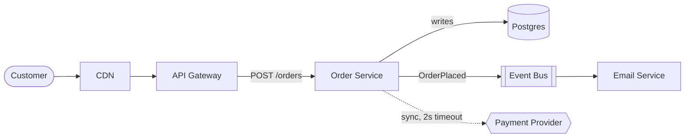
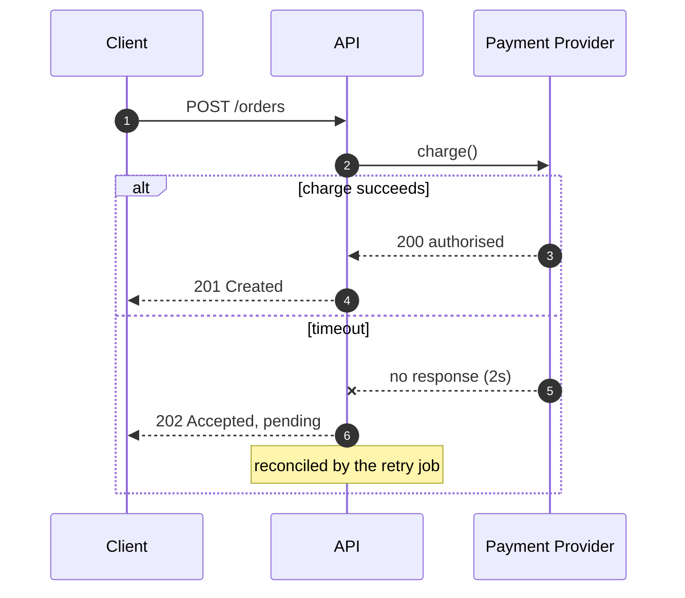

# Diagramming

A diagram earns its place by answering one question faster than a paragraph could. A diagram
showing everything answers nothing — it is the visual equivalent of a page with no headings.

**Draw diagrams as code.** A Mermaid block in the repository is diffable, reviewable, and edited
by whoever changes the system. An exported PNG from someone's laptop is wrong within a month and
nobody can fix it.

## 1. Decide the question, then pick the type

Match the diagram to what the reader is asking:

| Reader's question | Diagram |
| --- | --- |
| What are the pieces and how do they connect? | Component / C4 container |
| What happens, in what order, between whom? | Sequence |
| What states can this be in, and what moves it? | State |
| How is the data shaped and related? | ER |
| What are the steps and decisions? | Flowchart |
| Who depends on whom for deployment? | Deployment |

Choosing wrong is the most common failure. Component diagrams are drawn for questions that are
really about ordering, and a sequence diagram would have answered them in half the space.

**Done when:** you can state the one question this diagram answers.

## 2. Pick one level of abstraction and stay there

Mixing levels is what makes diagrams unreadable — a box for "Payments" next to a box for
"validate_card()" gives the reader no consistent scale to reason at.

The C4 levels are a useful discipline even without adopting the notation:

1. **Context** — your system and the people and systems around it. One box for you
2. **Container** — the deployable pieces: services, databases, queues, front ends
3. **Component** — inside one container
4. **Code**, usually better generated than drawn

Most useful diagrams are level 1 or 2. Level 3 dates fast; level 4 almost never earns its
maintenance.

**Done when:** every box on the diagram is the same kind of thing.

## 3. Keep it under about nine boxes

Past roughly nine elements, a reader stops seeing structure and starts tracing lines.

When you exceed it: split into several diagrams at different levels, collapse a group into one
labelled box, or cut everything not needed for this diagram's question. Splitting is almost
always better than shrinking the font.

**Done when:** the structure is visible without tracing.

## 4. Label the arrows

An unlabelled arrow is the most common defect in architecture diagrams. It could mean HTTP,
async event, dependency, or data flow, the reader cannot tell.

Label with **what and how**: "POST /charge (sync)", "OrderPlaced → Kafka", "reads replica".
Direction should mean one thing consistently across the diagram, usually the direction of the
request, not the data.

**Done when:** every arrow says what crosses it.

## 5. Write it in Mermaid

Renders natively in GitHub, GitLab, and many docs tools, so it lives next to the code.

Useful conventions: `[(...)]` for datastores, `[[...]]` for queues, `{{...}}` for external
systems, dashed arrows for async or unreliable calls, and `alt`/`else` in sequence diagrams for
the failure path.

**The failure path is the part worth drawing.** Everyone can imagine the happy path; the diagram
earns its keep by showing what happens on timeout.

**Done when:** the diagram renders and shows at least one failure case.

## 6. Keep it from going stale

- **Store it beside the code it describes**, not in a wiki
- **One diagram per question**, so a change touches one file
- **Date architecture diagrams**, or reference the version they describe
- **Review it when the system changes:** a diagram is documentation and rots the same way
- **Delete diagrams you no longer maintain.** A confidently wrong diagram is worse than none,
  because it is believed and it is fast to read

**Done when:** the diagram lives in version control next to what it describes.

## Don't set colours

The most common way a Mermaid diagram looks wrong is hand-set fills. A pastel fill chosen against
a white editor becomes unreadable on a dark background, and readers pick the theme, not you.

- **Leave the default theme alone.** It is already adjusted for both light and dark rendering
- **Never hardcode `fill:` or `color:`** in `classDef` or `style` lines. A fixed fill with a
  theme-driven text colour produces black-on-navy or white-on-cream
- **Where emphasis matters, use shape or line style** instead: a different node shape, a dashed
  edge, a subgraph boundary. Those survive every theme
- **If you must use colour**, set foreground and background together so contrast is fixed, and
  check both themes before committing

The same applies to the diagram's size. A wide `flowchart LR` gets scaled down to fit the page
and the labels become unreadable; `flowchart TD` usually survives narrow columns better.

## Accessibility and rendering

Add a one-line text summary beneath any non-trivial diagram — it serves screen readers, it
appears where Mermaid does not render, and writing it is a good test of whether the diagram has
a clear point. If you cannot summarise it in a sentence, it is probably answering more than one
question.
