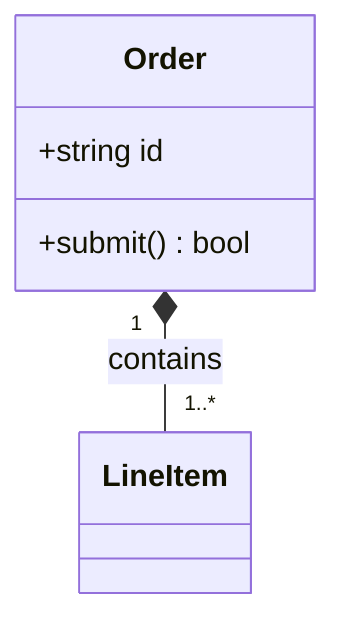

# Class Diagram Syntax

## Structure

Use visibility markers and method signatures only when the audience needs implementation detail. Keep relationship labels verb-first and distinguish composition from simple association.

## Namespaces

Use namespaces for large systems with meaningful package boundaries. If the renderer or target embed does not support the syntax reliably, use a package label or split the diagram instead of hiding relationships.

## Audience scaling

- Technical: supported attributes, methods, visibility, and relationship multiplicity.
- Analyst: class names, responsibilities, and relationships; omit methods unless they explain behavior.
- Executive: prefer a context or capability view over a class diagram.
