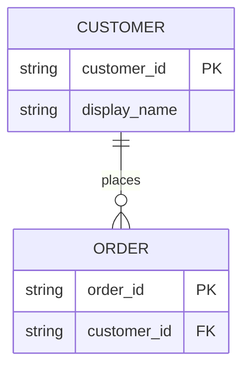

# ER Diagram Syntax and Cardinality Conventions

Use Mermaid `erDiagram` for entities and relationships. Treat field names, types, keys, and cardinalities as evidence-backed content; label inferred design choices as assumptions.

## Entity and attribute syntax

Use `PK` and `FK` only when the source schema or design explicitly establishes them. Omit field lists for Executive and most Analyst views.

## Cardinality notation

Use `||` for exactly one, `o|` for zero or one, `|{` for one or more, and `o{` for zero or more. Read `CUSTOMER ||--o{ ORDER` as “one customer may place zero or more orders, and each order belongs to exactly one customer.” Add a relationship label that describes the verb.

## Audience scaling

- Executive: flag ERD as potentially too technical; offer a C4 Context or flowchart.
- Analyst: show entity names, relationship verbs, and cardinality; omit field lists unless requested.
- Technical: show supported fields, types, PK/FK markers, and source-of-truth metadata.
