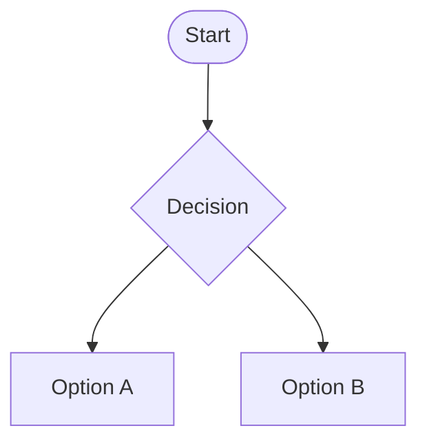
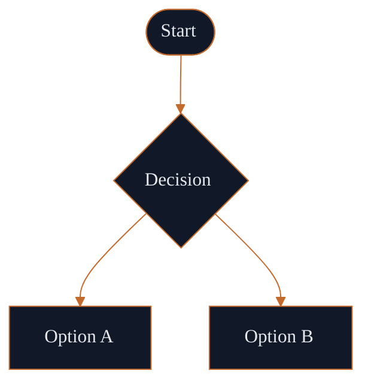

# okhp3-mermaid-theme-builder

Apply reusable color palettes and visual governance to Mermaid diagram code. This skill packages the theming logic from the [Mermaid Theme Builder](https://okhp3.github.io/mermaid-theme-builder) web app into a headless, browser-free format consumable by any SKILL.md-compatible agent platform.

---

## What it does

Generates renderer-aware `%%{init}%%` directives with `themeVariables` for 7 built-in palettes across 27+ Mermaid diagram families. Produces styled code, YAML frontmatter, Markdown bootstrap documents, and LLM prompt scaffolds - all validated against a 7-renderer compatibility matrix.

---

## Install

### Claude Code

```bash
# Clone or copy the skill into your project
cp -r skills/okhp3-mermaid-theme-builder ~/.claude/skills/

# Or reference directly in CLAUDE.md
echo "## Skills\n- skills/okhp3-mermaid-theme-builder/SKILL.md" >> CLAUDE.md
```

### GitHub Copilot (VS Code)

```bash
# Add to your workspace instructions
mkdir -p .github/instructions
cp skills/okhp3-mermaid-theme-builder/SKILL.md .github/instructions/mermaid-theme-builder.instructions.md
```

Add to `.github/copilot-instructions.md`:
```markdown
When the user asks to style or theme a Mermaid diagram, follow the instructions in
.github/instructions/mermaid-theme-builder.instructions.md
```

### Cursor

```bash
# Add to .cursorrules or .cursor/rules/
cp skills/okhp3-mermaid-theme-builder/SKILL.md .cursor/rules/mermaid-theme-builder.mdc
```

### VS Code (Custom Instructions)

Copy the contents of `SKILL.md` into your VS Code GitHub Copilot custom instructions panel (`Ctrl+Shift+P` → "GitHub Copilot: Open Custom Instructions").

### Gemini CLI

```bash
# Add SKILL.md to your Gemini CLI context
gemini --context skills/okhp3-mermaid-theme-builder/SKILL.md "Style this Mermaid diagram with the OverKill Hill P³ palette"
```

---

## Example trigger prompts

- "Apply the OverKill Hill P³ theme to this flowchart"
- "Give me a GitHub-safe themed version of this sequence diagram"
- "Generate a prompt scaffold for Mermaid diagrams using the AskJamie palette"
- "Style this architecture diagram with Ocean Depth colors and show the themeVariables"
- "Create a Mermaid theme block for Obsidian using Violet Mist"

---

## Before / after example

**Input (unstyled flowchart):**



**Output (OverKill Hill P³ applied):**



---

## Links

- **Live tool:** https://okhp3.github.io/mermaid-theme-builder
- **GitHub:** https://github.com/OKHP3/mermaid-theme-builder
- **Project page:** https://overkillhill.com/projects/mermaid-theme-builder/
- **Reference:** `references/` directory
- **JSON assets:** `assets/` directory
- **Scripts:** `scripts/` directory (Node.js, no external deps)
- **Tests:** `node --test tests/*.test.mjs`

---

## Palette IDs

| ID | Name | Best for |
|---|---|---|
| `overkill-hill` | OverKill Hill P³ | Technical, architecture, AI tooling |
| `askjamie` | AskJamie | Support flows, user guidance |
| `glee-fully` | Glee-fully | Consumer-facing, personal productivity |
| `ocean-depth` | Ocean Depth | Professional technical docs |
| `forest-sage` | Forest Sage | Process flows, approachable content |
| `slate-ember` | Slate Ember | Dark-mode architecture diagrams |
| `violet-mist` | Violet Mist | Product, UX, creative flows |
